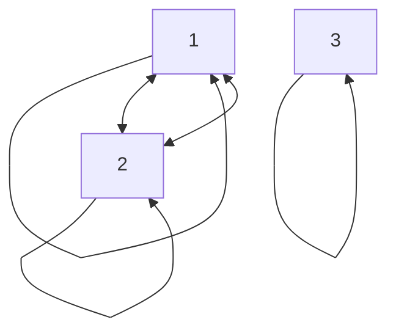
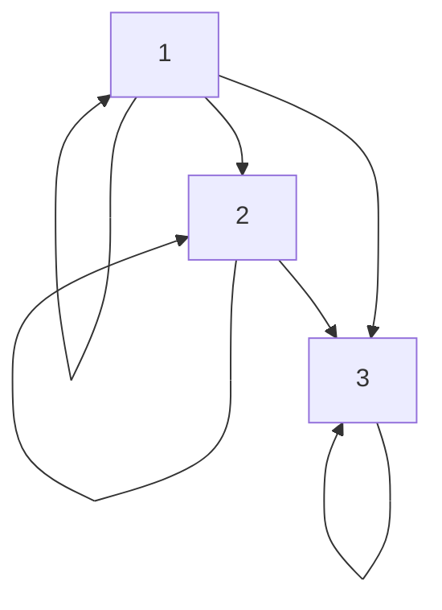

> A binary relation from $A$ to $B$ is a set $R$ of ordered pairs, where the first element of each ordered pair comes from $A$ and the second element comes from $B$

Let $A$ and $B$ be sets. A binary relation from $A$ to $B$ is a subset of $A \bigtimes B$. 

The relation is the visualization of the relation $R$ between [[Sets]] $A$ and $B$. Let $A = \{0,1,2\}$ and $B = \{a,b\}$, then $R = \{(0, a), (0, b), (1, a), (2, b)\}$.

A set can have a relation to itself. A relation on a set $A$ is a relation from $A$ to $A$ and is a subset of $A \bigtimes A$.
## 0.1 Examples
$$ 
A = \{1,2,3,4\}
$$
$$
\text{Which ordered pairs are in the relation } R = \{(a, b) \mid \text{a divides b}\}
$$
$$R = \{(1, 1), (1, 2), (1, 3), (1, 4), (2, 2), (2, 4), (3, 3), (4,4)\}$$

# 1 Functions
Functions can be used as relations. It is important to note that a function is only a function if a distinct input will always result in the same output. In other words, the function $f(x)=x+2$ will always have $3$ as its output if $1$ is the input.
## 1.1 Definitions
### 1.1.1 Codomain and Domain
If $f$ is a function from $A$ to $B$, we say that $A$ is the *domain* of $f$ and $B$ is the *codomain* of $f$ .
### 1.1.2 Image, Preimage, Range and Maps
If $f(a)=b$, we say $b$ is the *image* of $a$ and $a$ is the *preimage* of $b$. The *range*, or *image*, of $f$ is the set of all images of elements of $A$. Also, if $f$ is a function from $A$ to $B$, we say that $f$ *maps* $A$ to $B$.
# 2 Composite Relations
Let $R$ be the relation from set $A$ to set $B$ and $S$ be the relation from $B$ to $C$. We can now combine these relations into a composite relation consisting of ordered pairs $(a,c)$, where $a \in A, c \in C$, and for which there exists an element $b \in B$ such that $(a,b) \in R$ and $(b,c) \in S$. This composite relation would be denoted with $S \circ R$.
![[28147.png]]
# 3 Closures
A closure is the smallest relation $R$ possible to fulfill a given property $\mathbf{P}$. 
## 3.1 Example
The relation $R = \{(1,1), (1,2), (2,1), (3,2)\}$ on set $A = \{1,2,3\}$ is not reflexive. By adding the pairs $(2,2), (3,3)$ to the relation, we make a reflexive closure. 
# 4 Definitions
## 4.1 Reflexive
A relation is said to be reflexive if $(a,a) \in R$ for every element ${a \in A}$.
### 4.1.1 Examples
$$ 
\begin{aligned}
A &= \{1,2,3,4\} \\
R &= \{(1,1), (2,2), (3,3), (4,4)\}
\end{aligned}
$$
## 4.2 Symmetric
A relation is said to be symmetric if $(b,a) \in R$ whenever $(a,b) \in R$, for all $a, b \in A$.
### 4.2.1 Examples
$$ 
\begin{aligned}
A &= \{1,2,3,4\} \\
R &= \{(1,2), (2,1)\}
\end{aligned}
$$
## 4.3 Antisymmetric
A relation is called antisymmetric if for all $a,b \in A$, if $(a,b) \in R$ and $(b,a) \in R$, then $a=b$.
### 4.3.1 Examples
$$ 
\begin{aligned}
A &= \{1,2,3,4\} \\
R &= \{\{1,2\}, \{3,3\}, \{4,4\}\}
\end{aligned}
$$
## 4.4 Transitive
A relation $R$ is said to be transitive if whenever $(a,b) \in R$ and $(b,c) \in R$, then $(a,c) \in R$ for all $a,b,c \in R$ 
### 4.4.1 Examples
$$ 
\begin{aligned}
A &= \{1,2,3,4\} \\
R &= \{(1,2), (2,3), (1,3)\}
\end{aligned}
$$
## 4.5 Equivalence Relation
A relation on set $A$ is called an equivalence relation if it is [[Relations#3.1 Reflexive]], [[Relations#3.2 Symmetric]], and [[Relations#3.4 Transitive]]. Two elements, $a$ and $b$, are related by an equivalence relation are said to be equivalent. This would be denoted by $a \sim b$ 
### 4.5.1 Examples
$$ 
\begin{aligned}
A &= \{1,2,3\} \\
R &= \{(1,1), (2,2), (3,3), (1,2), (2,1)\}
\end{aligned}
$$

## 4.6 Partial Ordering
A relation on set $A$ is called a partial ordering or partial order if it is [[Relations#3.1 Reflexive]], [[Relations#3.3 Antisymmetric]], and [[Relations#3.4 Transitive]]. 

A set together with a partial ordering is called a partial ordered set or *poset*.

The notation $a \preceq b$ is used to denote that $(a, b) \in R$ in an arbitrary
poset $(S, R)$
### 4.6.1 Examples
$$ 
\begin{aligned}
A &= \{1,2,3\} \\
R &= \{(1,1), (2,2), (1,2), (1,3), (2,3)\}
\end{aligned}
$$

## 4.7 Comparable / Incomparable
Two elements are set to be comparable if one is related to the other under the given partial order, meaning $a \preceq b$ or $b \preceq a$ holds. If this does not hold, they are called incomparable.
## 4.8 Total Order / Chain / Linear Order
A total order is a poset where every pair of elements are comparable. 
### 4.8.1 Example
The $(S, \le)$ poset $S = \{1,2,3,4,5\}$ is an example of a total order poset.